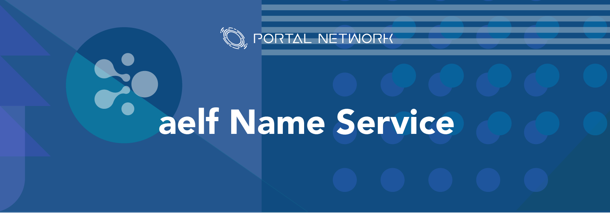

> 📖🔍 Documents of the Aelf Name Service.

## 📝 Description

WNS is the Aelf Name Service, a distributed, open, and extensible naming system based on the Aelf blockchain.

## 📚 Documents

#### Table of Contents
-  [Introduction](./docs/INTRODUCTION.md)

## 📣 Contributing
See [CONTRIBUTING.md](./CONTRIBUTING.md) for how to help out.

## 🗒 Licence
See [LICENSE](./LICENSE) for details.
